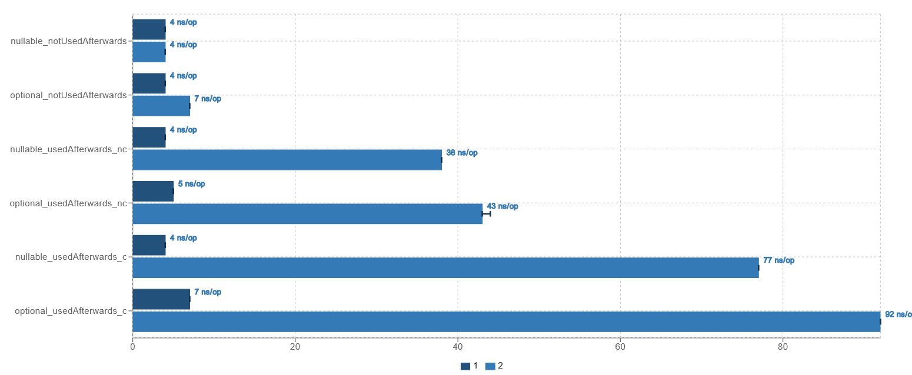
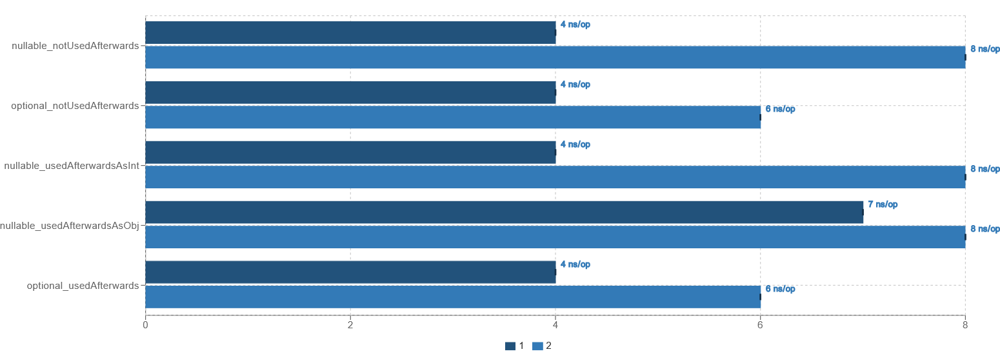

# Benchmarking Java's Optional<T> class

This is the accompanying repository to [my medium article](https://ablingeroscar.medium.com/benchmarking-optional-in-java-2609a7a0c1e9),
where I investigated how much slower `Optional<T>` really is.
I also took a look at the class `OptionalInt`, which a specialised
optional for integers that avoids boxing – and to my surprise it
is actually faster than using `Integer`.

## The raw data

If you run the benchmark on my PC, numbers similar to the following
pop up (re-ordered for your convenience):

```
Benchmark                                           (number)  Mode  Cnt   Score   Error  Units
OptionalBenchmarkString.nullable_notUsedAfterwards         1  avgt    3   4,167 ± 0,072  ns/op
OptionalBenchmarkString.optional_notUsedAfterwards         1  avgt    3   4,184 ± 0,348  ns/op
OptionalBenchmarkString.nullable_notUsedAfterwards         2  avgt    3   4,183 ± 0,211  ns/op
OptionalBenchmarkString.optional_notUsedAfterwards         2  avgt    3   7,031 ± 0,513  ns/op

OptionalBenchmarkString.nullable_usedAfterwards_c          1  avgt    3   4,172 ± 0,054  ns/op
OptionalBenchmarkString.optional_usedAfterwards_c          1  avgt    3   7,067 ± 0,449  ns/op
OptionalBenchmarkString.nullable_usedAfterwards_c          2  avgt    3  76,907 ± 5,096  ns/op
OptionalBenchmarkString.optional_usedAfterwards_c          2  avgt    3  92,195 ± 9,642  ns/op

OptionalBenchmarkString.nullable_usedAfterwards_nc         1  avgt    3   4,172 ± 0,027  ns/op
OptionalBenchmarkString.optional_usedAfterwards_nc         1  avgt    3   4,652 ± 0,050  ns/op
OptionalBenchmarkString.nullable_usedAfterwards_nc         2  avgt    3  37,831 ± 1,516  ns/op
OptionalBenchmarkString.optional_usedAfterwards_nc         2  avgt    3  42,699 ± 3,623  ns/op

OptionalBenchmarkInt.nullable_notUsedAfterwards            1  avgt    3   4,581 ± 3,377  ns/op
OptionalBenchmarkInt.optional_notUsedAfterwards            1  avgt    3   4,178 ± 0,097  ns/op
OptionalBenchmarkInt.nullable_notUsedAfterwards            2  avgt    3   7,698 ± 0,068  ns/op
OptionalBenchmarkInt.optional_notUsedAfterwards            2  avgt    3   6,279 ± 0,253  ns/op

OptionalBenchmarkInt.nullable_usedAfterwardsAsInt          1  avgt    3   4,169 ± 0,012  ns/op
OptionalBenchmarkInt.nullable_usedAfterwardsAsObj          1  avgt    3   7,413 ± 0,086  ns/op
OptionalBenchmarkInt.optional_usedAfterwards               1  avgt    3   4,171 ± 0,037  ns/op
OptionalBenchmarkInt.nullable_usedAfterwardsAsInt          2  avgt    3   7,646 ± 0,042  ns/op
OptionalBenchmarkInt.nullable_usedAfterwardsAsObj          2  avgt    3   7,646 ± 0,111  ns/op
OptionalBenchmarkInt.optional_usedAfterwards               2  avgt    3   6,482 ± 1,057  ns/op
```

Thanks to [jmh-visualiser](https://github.com/jzillmann/jmh-visualizer),
there are also some visualisations:



